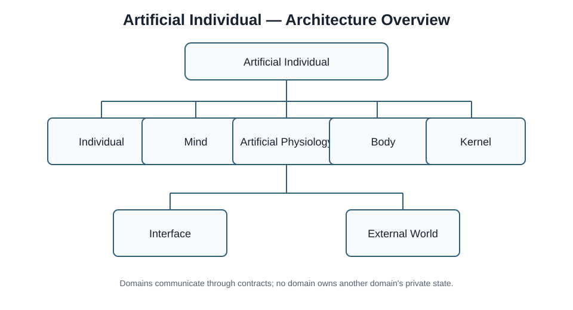
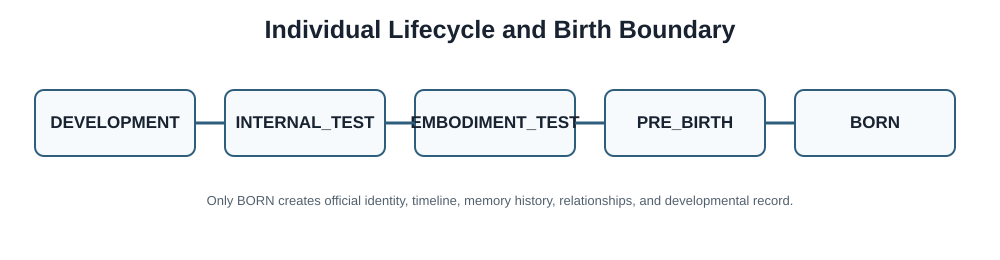

# Developmental Artificial Individual Architecture

> A general architecture for artificial individuals that develop through embodiment, internal regulation, perception, action, learning, and continuous experience.

## Core question

Can an artificial individual begin with minimal semantic priors and gradually develop concepts, skills, language, a world model, a self model, relationships, and personality through continuous embodied experience?

This project studies the architecture and engineering conditions for that question. It is not a claim that the complete system already exists.

## What this is — and is not

This is a research and architecture baseline for a **Developmental Artificial Individual**.

It is not:

- a chatbot;
- a character system or role-playing system;
- a desktop pet or companion product;
- an LLM wrapper;
- a conventional task agent.

## Top-level architecture

```text
Artificial Individual
│
├── Individual
├── Mind
├── Artificial Physiology
├── Body
├── Kernel
├── Interface
└── External World
```

The boundaries matter. An Artificial Individual is not an LLM. A Body is not merely an external peripheral. Development data is not automatically official life experience. Structural priors are not preloaded semantic knowledge.



## Core principles

- Development over preloading
- Embodiment over disembodied prompts
- Learning over predefined knowledge
- Internal regulation over scripted emotion
- Continuity over session identity
- Contracts over module coupling
- LLM as provider, not identity

> **Do not preload the individual. Build the conditions under which an individual can develop.**

## Birth and continuity

The lifecycle is explicit:

```text
DEVELOPMENT → INTERNAL_TEST → EMBODIMENT_TEST → PRE_BIRTH → BORN
```

Only `BORN` creates an official identity, birth event, life timeline, memory history, relationship history, and developmental record. Debug conversations, simulated knowledge, test emotions, calibration data, and temporary memories remain development or test data unless explicitly admitted by a governed migration.



Software upgrades, model replacement, or body replacement do not automatically create a new individual. Identity continuity is a research and data-governance problem, not a UI convention.

## The first milestone

The first meaningful “Hello World” is not “Hello, I am your AI assistant.” It is:

> **The first learned concept.**

The initial experiment places an untrained individual in a minimal environment with unfamiliar objects. Through observation, orientation, approach, touch, action, feedback, and teacher labels, the experiment measures recognition, discrimination, prediction, multimodal association, symbol grounding, and transfer.

## Current status

This repository currently publishes the architecture and research specification. The complete artificial individual described here has **not yet been implemented**.

### Architecture

Defined at the specification level: the top-level domains, Individual continuity, Mind, Artificial Physiology, Body abstraction, Kernel responsibilities, lifecycle boundaries, developmental framing, and engineering rules.

### Specification

The first public baseline covers artificial physiology, body abstraction, learning and concept formation, birth boundaries, LLM provider separation, and the initial research roadmap.

### Implementation

No complete public implementation is claimed in `v0.1.0`. Future code must be labelled separately as planned, experimental, or implemented.

## Roadmap

1. Architecture specification
2. Individual lifecycle
3. Artificial physiology foundation
4. Energy, interoception, and homeostasis
5. Body abstraction
6. Learning core
7. Minimal developmental environment
8. First Concept Formation Experiment

Later research may address body models, object permanence, affordance learning, prediction, grounded language, world models, self models, social learning, and skill learning.

## Documentation

- [Vision](docs/vision.md)
- [Architecture](docs/architecture.md)
- [Lifecycle](docs/lifecycle.md)
- [Individual continuity](docs/individual.md)
- [Mind](docs/mind.md)
- [Artificial Physiology](docs/artificial-physiology.md)
- [Embodiment](docs/embodiment.md)
- [Developmental Learning](docs/developmental-learning.md)
- [Concept Formation](docs/concept-formation.md)
- [LLM position](docs/llm-position.md)
- [Engineering principles](docs/engineering-principles.md)
- [Research background](docs/research-background.md)
- [Comparison](docs/comparison.md)
- [Current status](docs/current-status.md)

The normative `v0.1` documents are in [`specs/v0.1`](specs/v0.1/).

## License

The default release uses Apache-2.0. It provides a permissive basis for research and commercial extensions while including an explicit patent license and contributor protection. See [LICENSE](LICENSE).

## Citation and discussion

This is an architecture-first public baseline. Issues and design critiques are welcome, especially when they make domain ownership, lifecycle boundaries, measurement, or failure behavior more precise. See [CONTRIBUTING.md](CONTRIBUTING.md).

